# Threat modeling (OWASP Dragon)

# Threat Modeling LAB

## Storyline

Trabajamos para una StartUp que se dedica al despliegue de cargadores para vehículos eléctricos en la ciudad. Para ello, está diseñando una aplicación web que permitirá a los usuarios acceder a un mapa con todos los puntos de recarga y activar el cargador de forma remota bajo demanda. 

A continuación se muestra un esquema del sistema propuesto


Nos han pedido hacer un análisis de amenazas `Threat Modeling` utilizando el modelo `STRIDE`. Para acotar el problema, nos centraremos en la interacción del usuario con el servicio web y el almacenamiento en una base de datos SQLServer. Tal y como se muestra a continuación


## Requisitos

Utilizaremos la herramienta [OWASP Threat Dragon](https://github.com/OWASP/threat-dragon). Para ello, utilizaremos Docker para desplegar la aplicación en local
- [Docker](https://docs.docker.com/)

## Lab

0.1- Crearemos el fichero .env necesario para ejecutar `Threat Dragon`

```bash
cat << EOF > .env
ENCRYPTION_KEYS='[{"isPrimary": true, "id": 0, "value": "11223344556677889900aabbccddeeff"}]'
ENCRYPTION_JWT_SIGNING_KEY=asdfasdfasdf
ENCRYPTION_JWT_REFRESH_SIGNING_KEY=fljasdlfkjadf
NODE_ENV=development
SERVER_API_PROTOCOL=http
EOF
```

1- Desplegamos el Contenedor Docker, i exponemos la aplicación en el puerto `8080`

```bash
docker run -d --name threat-dragon -p 8080:3000 -v $(pwd)/.env:/app/.env ghcr.io/thematrix97/threat-dragon:v2.3.0
```
> Podéis revisar que la aplicación está en marcha con el comando `docker ps`

2- Accederemos a la herramienta utilizando nuestro navegador Web favorito `http://localhost:8080`.

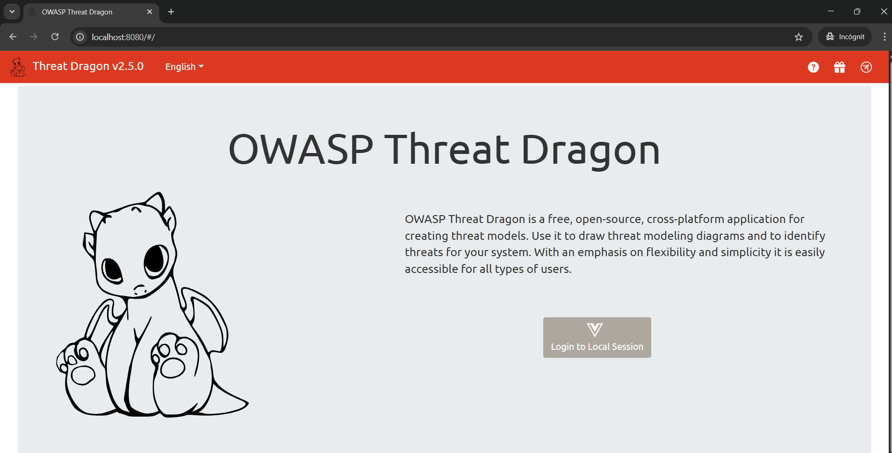

> Para esta demo haremos login con una sesión en local (`Login to Local Session`).

3- Crearemos un nuevo modelo de amenazas, indicando el título de este junto al nombre del propietario. Además, añadiremos un Diagrama de tipo `STRIDE`
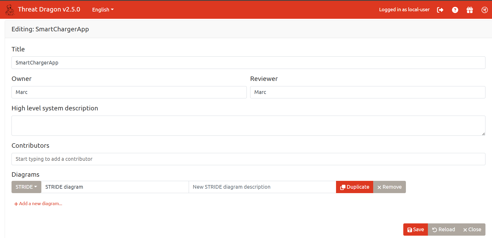

4- Guardaremos el modelo con la opción `Save` y haremos click en `Close` para acceder a la vista general del modelo. Una vez ahí, haremos click sobre el diagrama `STRIDE` para modificarlo

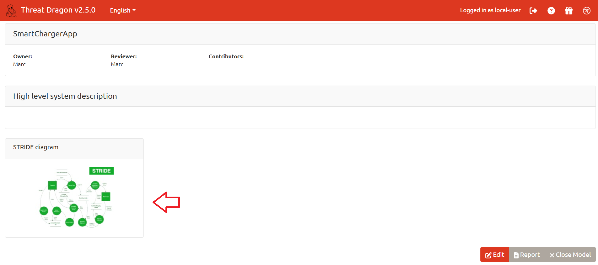

5- Añadiremos el recurso `Process` a nuestro proyecto. Este representará la aplicación web que dará servicio a los usuarios.
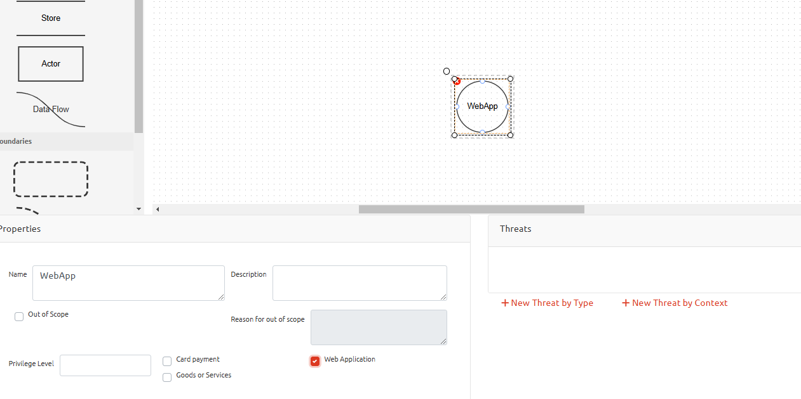

> ¡No os olvidéis de marcar la opción `Web Application` en las propiedades!

6- A continuación, añadiremos el objeto `Actor`, que representará los clientes que interactuaran con esta aplicación web. Cambiaremos el nombre del objeto por `Clientes` para mayor claridad.

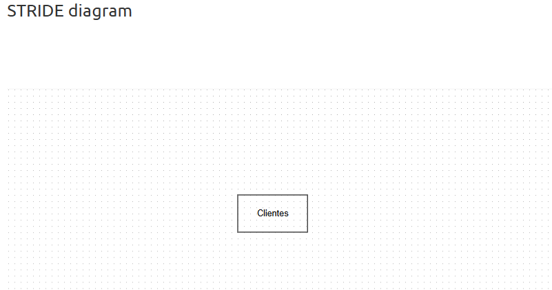

7- Definiremos los flujos de datos entre los clientes y la aplicación web, estos serán del tipo `HTTP`. Un flujo de `request` de cliente a la aplicación web y el flujo contrario de respuesta, tal y como se muestra a continuación. Marcaremos la opción `Public network` para indicar que el flujo de datos atravesará una red pública

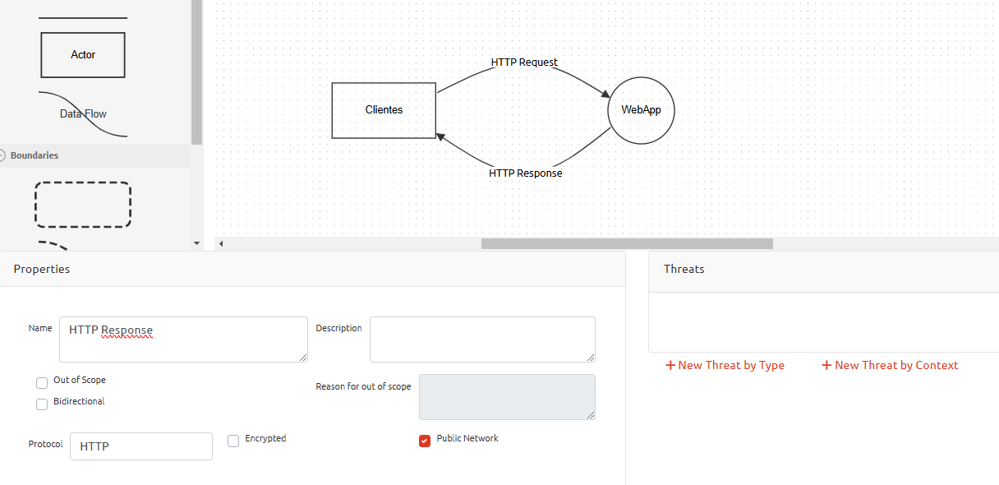

5- Si no indicamos lo contrario, el diagrama mostrará que todos los componentes del modelo residen en el mismo dominio. En este caso concreto, tendremos que indicar que el tráfico entre el cliente y la aplicación web atraviesa `Internet`. Esta característica la definiremos dibujando una línea `trust boundary`, que cruzará el flujo definido anteriormente

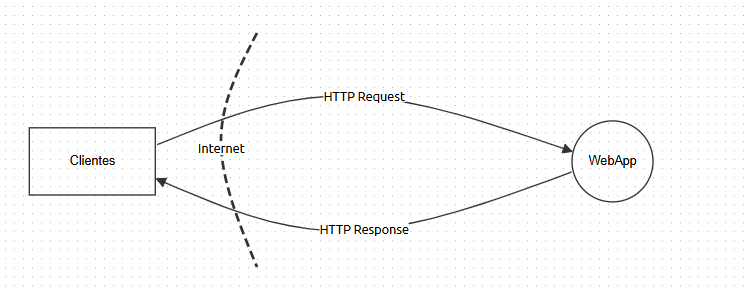

6- En este punto, ya tenemos una primera iteración del modelo. Lo analizaremos para revisar las amenazas que detecta la herramienta. Primero, auto-generaremos las amenazas referentes a la webapp. Para ello, seleccionaremos el proceso `WebApp` y en el apartado `Threats`, haremos click sobre `New Threat by Context`. Esta opción nos mostrará un diálogo con información de las amenazas detectada.

> Revisa el contenido de la amenaza y aplícala al modelo. *Las amenazas se aplican una a una*

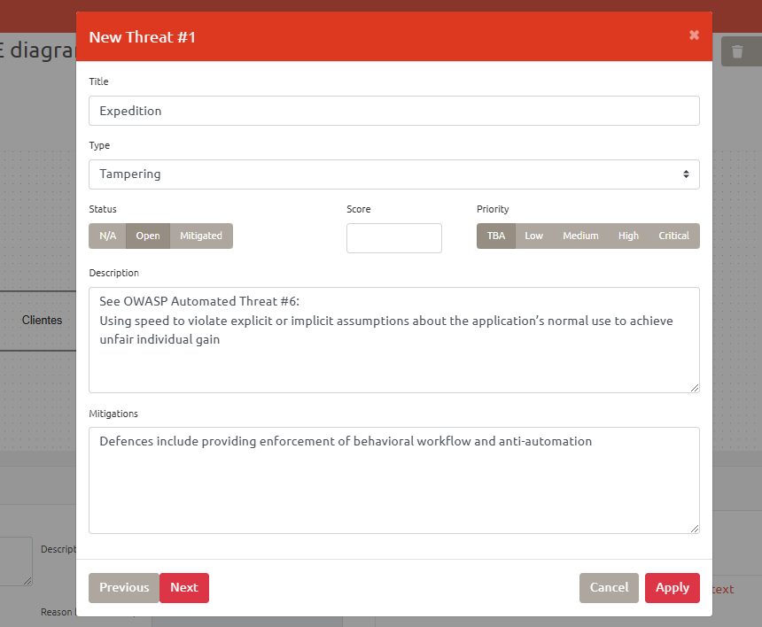

Si hemos configurado bien los componentes, nos debería de generar las siguientes amenazas.

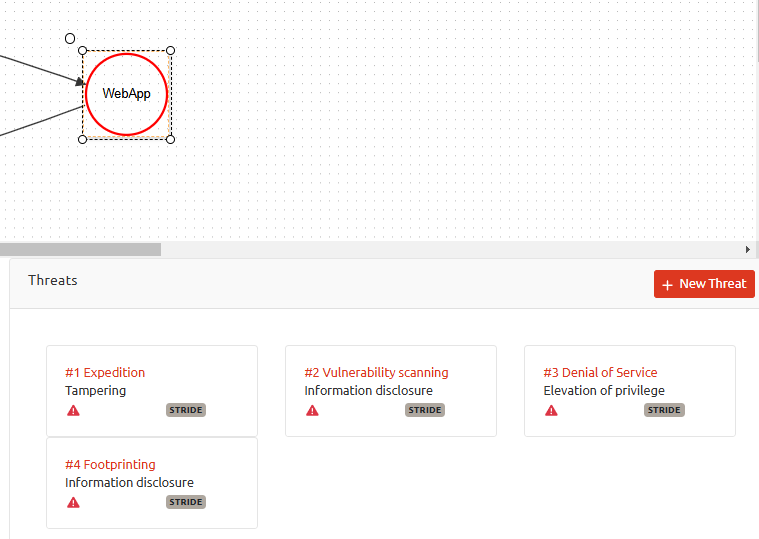

7- Selecciona el resto de componentes del modelo y genera la amenazas recomendadas por contexto.


8- Si nos fijamos, hay una amenaza relacionada con la utilización de un canal de datos no seguro entre el cliente y la aplicación Web (`Use Encryption`), de tipo `Information discosure`. Modificaremos el modelo, substituyendo las conexiones `HTTP` por `HTTPS` y marcando la opción `encrypted` en los flujos de datos.


9- En este punto, podemos marcar las amenazas de `Use encryption` como mitigadas. Para ello accederemos a la opción de edición y las marcaremos como `Mitigated`

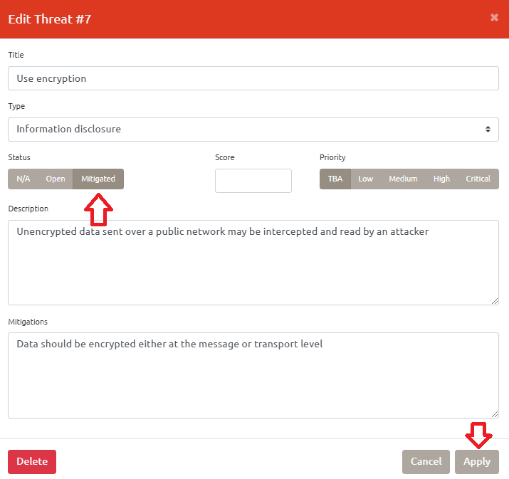

> Haz esto para todos flujos de datos

10- Si volvéis a generar las amenazas asociadas a las peticiones HTTPs, veréis que propone una nueva amenaza (`Vulnerable transport protocol`). Añade esta amenaza para tenerla en cuenta de cara a la implementación. En este caso, le daremos una prioridad `High`

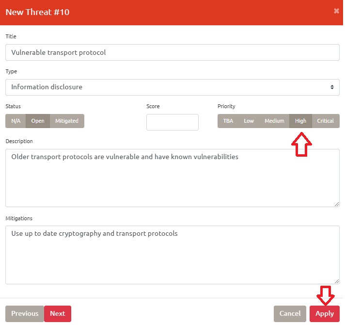

> Añade esta amenaza en todos los flujos de datos `HTTPs`

11- El siguiente paso es incluir la conexión con la base de datos SQL (`Store`). La utilizaremos para almacenar el estado de la aplicación: usuarios, peticiones de carga, registros de cargadores... etc.

Añadiremos los siguientes atributos acorde a nuestro caso de uso:
- Stores Credentials (Yes)
- Encrypted (Yes)
- Stores inventory (Yes)

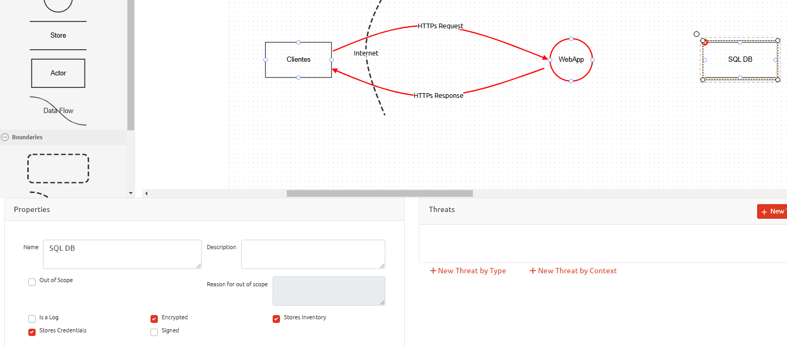

12- Conectaremos la base de datos con la aplicación web, utilizando una conexión `Data Flow`, que representa un canal cifrado y autenticado mediante SSL, en la implementación real se utilizará `TLS`.

Modificaremos los atributos de las conexiones con las características propias de una conexión TLS

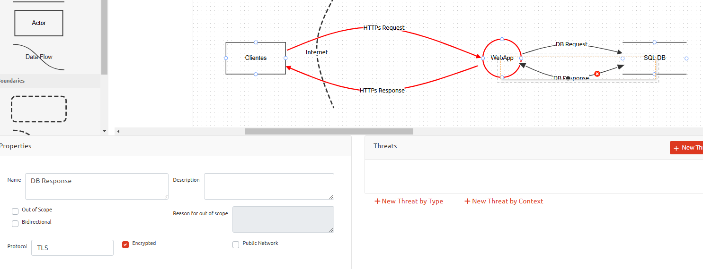


13- Analiza el modelo y revisa las amenazas que ha detectado la herramienta. ¿Crees que todas son aplicables a nuestro caso de uso?

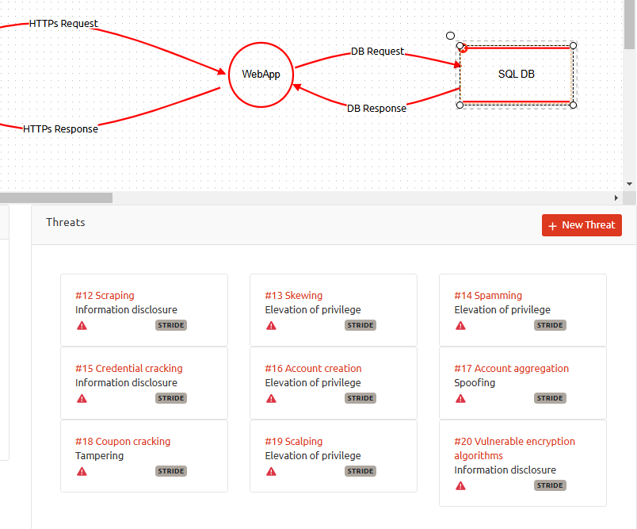

En nuestro caso, marcaremos la amenaza `Credential Cracking` como mitigada, ya que introduciremos una política de contraseñas segura y un `rate limit` en el formulario de login para mitigar ataques de fuerza bruta

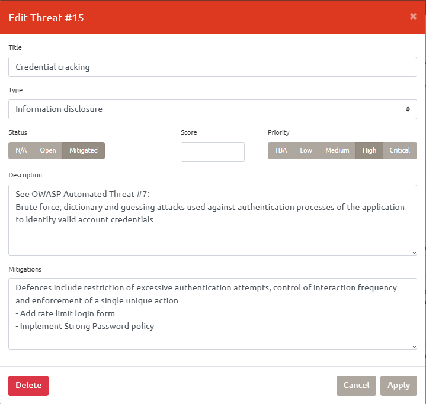


14- Guarda el modelo en formato JSON, cierra la vista del diagrama y genera un report completo del modelo de amenazas que hemos dibujado. Observa el informe generado. ¿Qué información incluye?

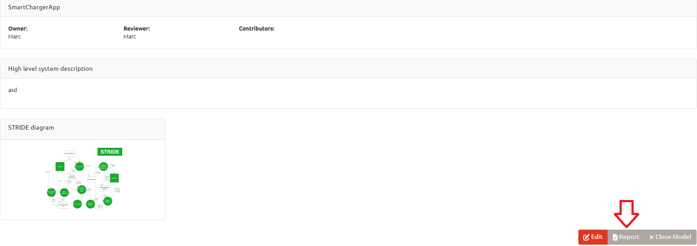

15- Guarda el informe en formato PDF con la herramienta `Print`
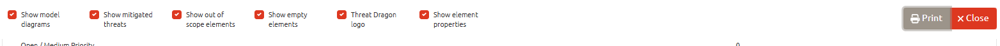

> Selecciona todas las opciones para la generación del informe

### Opcional

16- Queremos que nuestra aplicación permita a los usuarios hacer login con Google vía OAuth2.0 utilizando el flujo `Authorization Code Grant` y acceder a su información en la nube. Buscar información sobre este flujo e introduce los cambios necesarios en el modelo para incluir esta funcionalidad

<details>
<summary>Hint</summary>

A continuación se muestra una propuesta. Por una parte el cliente deberá acceder al proveedor para autorizar la aplicación, y por otra, la aplicación web tendrá que acceder al servicio para pedir el token y acceder a la información del usuario.

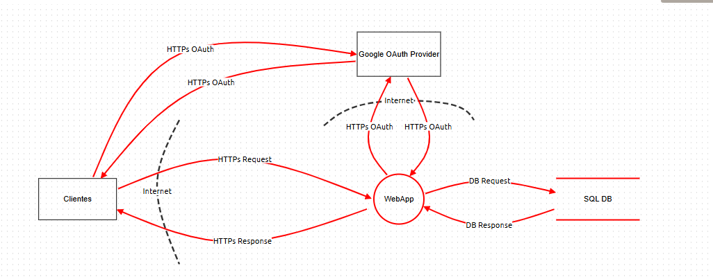

Encontrarás una propuesta de solución en el fichero [SmartChargerAppProposal.json](./extra/SmartChargerAppProposal.json)

</details>